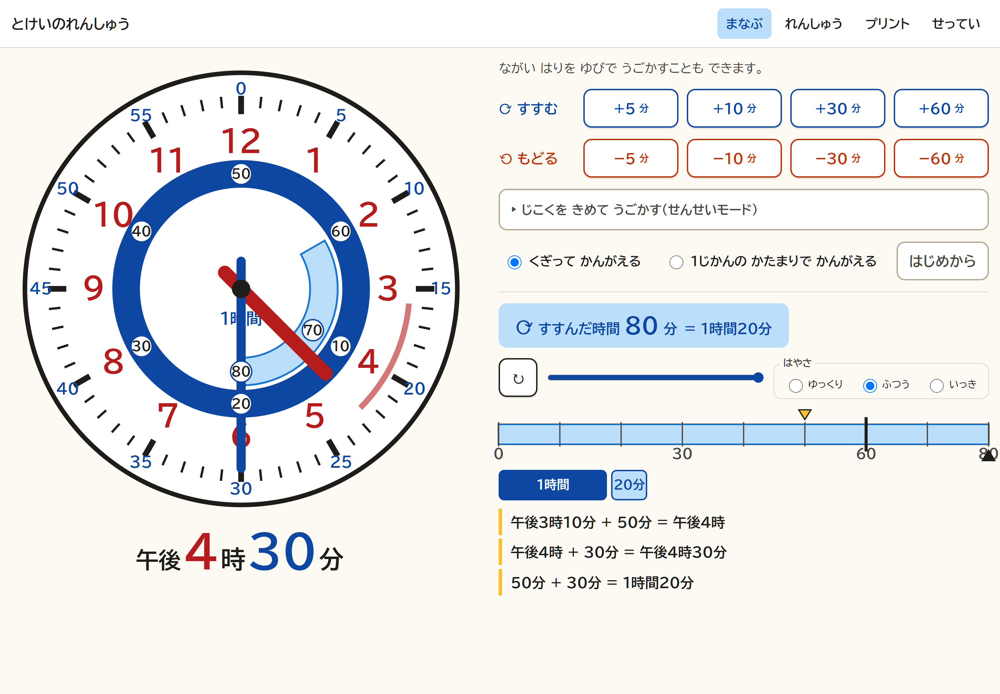
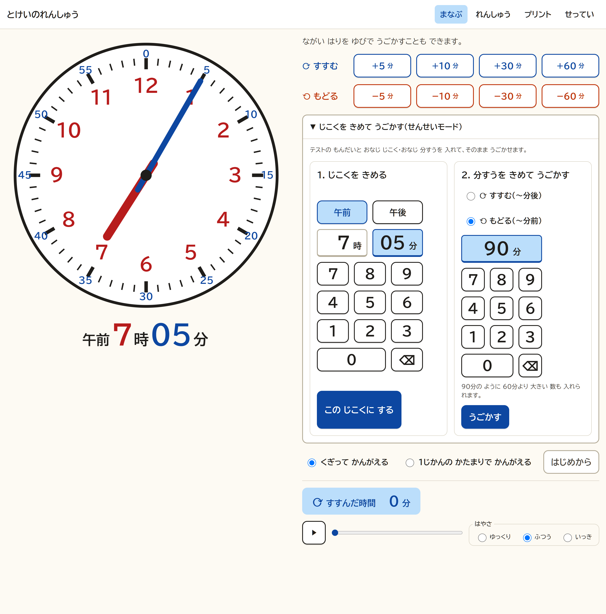
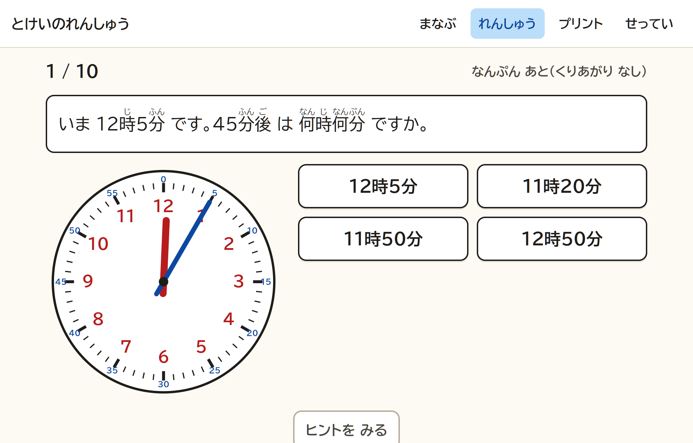
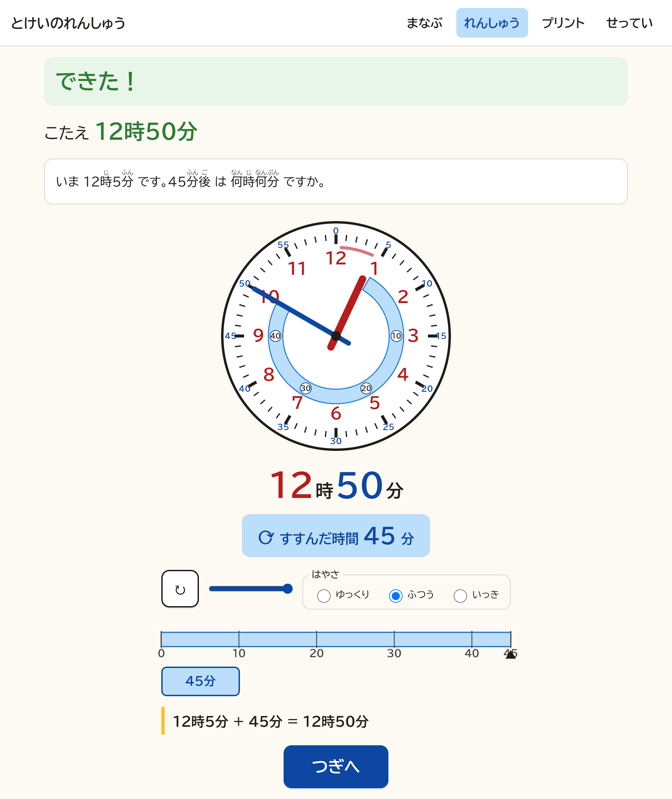
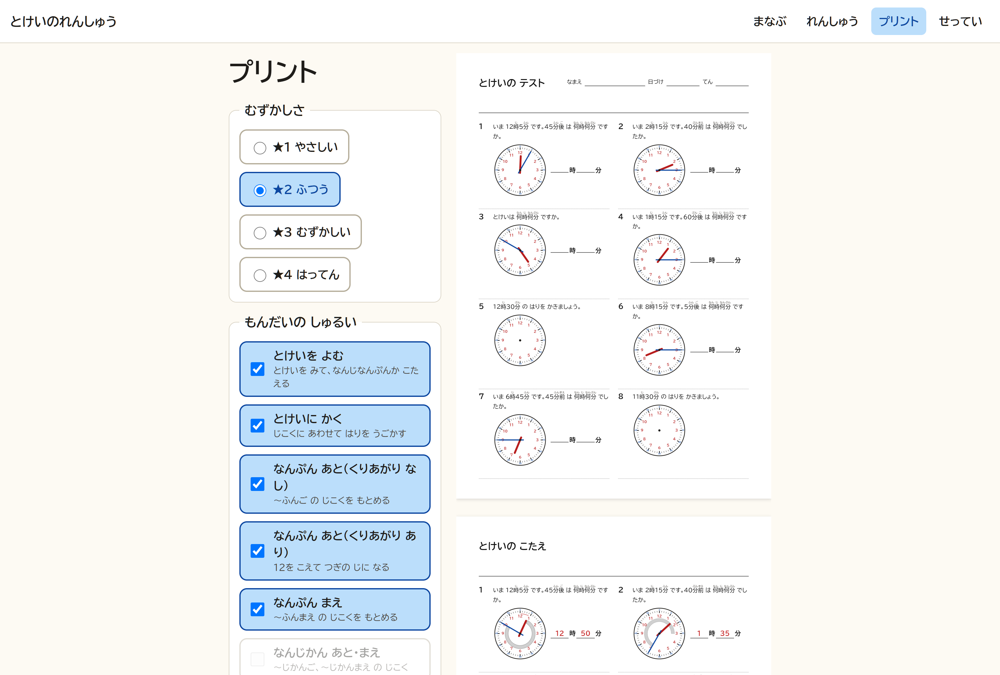
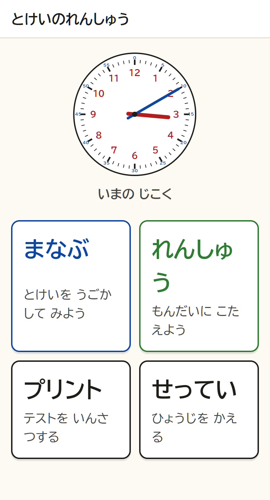

# とけいのれんしゅう（Tick-Tock-Clock）


[](https://tick-tock-clock.molkz.com/)
[](#pwa)
[](#構成)

**「45分後は何時？」が、針の動きと「量」で見える時計アプリ。**

小学2年生向けに、アナログ時計の読み方と「〜分後」「〜分前」「何分間」の計算を学べるブラウザアプリです。答えを覚えるのではなく、**針が実際に回り、動いた分が帯・数直線・ブロックとして残る**ので、「45分すすんだ」という量そのものが目で見えます。A4のテストプリントも作れます。

### ▶ いますぐ試す： **<https://tick-tock-clock.molkz.com/>**

インストール不要・ログイン不要・広告なし。スマートフォン、タブレット、PCのブラウザでそのまま動きます。



<sub>午後3時10分から80分すすめたところ。青い帯が動いた範囲、内側の輪が2周目（＝1時間を超えた分）、右側にカウンター・数直線・ブロック・式が同時に出ます。</sub>

## こんなときに使えます

| こまりごと | このアプリでは |
|---|---|
| 「〜分後」がなぜその時刻になるのか、言葉で説明しても伝わらない | 針を動かし、進んだ量を帯・数直線・ブロックの3通りで同時に見せます |
| 60分をまたぐ計算（3時10分の80分後）でつまずく | 12を通ると12が光り、帯が1つ内側の輪に移って「1時間ぶん回った」ことが見えます |
| 手元のテスト問題を、その場で一緒に確かめたい | **せんせいモード**で時刻と分すうを直接入力し、同じ条件を再現できます |
| 宿題用のプリントがほしい | A4に6/8/10問、解答ページ付きで印刷できます |

## 画面

### まなぶ ― 時計を動かして「量」を見る

+5〜+60分、−5〜−60分のボタンか、長い針のドラッグで時計を動かします。デジタル時計・経過分カウンター（60分を超えると「= 1時間20分」）・数直線・時間ブロック・式が、すべて同じ「経過分」に連動します。式は教科書式の「くぎって考える」と「1時間のかたまりで考える」を切り替えられます。

### せんせいモード ― 決まった時刻・分すうを再現する



テンキーで時刻を直接指定して針を一度で合わせ、分すうを入れて「すすむ（〜分後）」「もどる（〜分前）」の向きで動かします。**90分のように60分を超える分すう**も入力できるので、手元のテスト問題と同じ条件をそのまま再現して見せられます。教える側のための機能なので、ふだんは折りたたまれています。

### れんしゅう ― 10種類の問題と、必ず出る解説

| 出題 | 解説 |
|---|---|
|  |  |

よむ・かく・〜分後・〜分前・〜時間後・何分間・午前午後・時間と分の変換・文章題を、★1〜★4の難易度で10問出題します。答え方は4択・針を動かす・テンキー入力の3通り。ヒントは3段階で、使っても正解あつかいです。**正解でもまちがいでも、答えたあとには必ず動きの解説が再生されます。** まちがいの選択肢は「くり上がりを忘れた」など、よくあるつまずきから作っています。×や赤は使いません。

### プリント ― A4のテストと解答



難しさと問題の種類を選んで「つくる」を押すと、A4縦のプリントができます。1枚あたり6/8/10問、複数枚まとめて作成でき、解答ページでは答えが赤字、動いた範囲がグレーの帯で示されます。URLにシードが入るので、**同じプリントをあとから何度でも再印刷**できます。

### スマートフォン



ホームには今の時刻の時計と4つの入口だけを置いています。タップの的は56px以上、文字は大きめ、ふりがな付きです。

## せってい

ふりがな、午前・午後、解説のしかた、答えかた、動きの速さ、動きを減らす（コマ送り）、UD系フォントの切り替え、発展（秒針・24時間表示）を変えられます。れんしゅうの記録は端末の中だけに保存され、サーバーには送りません。

## PWA

一度開けばオフラインでも「まなぶ」「れんしゅう」「プリント」が動きます。ホーム画面に追加すればアプリのように起動できます。

## 3分で始める（手元で動かす）

```bash
git clone git@github.com:Satoshi-Hiramatsu/Tick-Tock-Clock.git
cd Tick-Tock-Clock
npm install
npm start
```

ブラウザで <http://127.0.0.1:8787> を開きます。

```bash
npm test          # 時刻計算・角度・アニメーター・問題生成の単体テスト
npm run deploy    # Cloudflare にデプロイ（wrangler login 済みが前提）
```

自分のドメインで運用する場合は `wrangler.jsonc` の `routes` を書き換えてください。

## 使い方

[利用ガイド](docs/USAGE.md) を参照してください。

## 構成

ビルド工程はありません。ブラウザがそのまま読む ES modules です。

```
public/                  画面資産（ビルドなし・ES modules）
  lib/time.js            時刻の計算（純粋関数）
  lib/angles.js          角度と SVG パス（純粋関数）
  lib/clock-svg.js       時計の描画・帯・ドラッグ
  lib/animator.js        経過分のアニメーション
  lib/problems/          問題生成（P1〜P10、難易度、4択の誤答）
  components/            動きのビュー、テンキー
  screens/               ホーム・まなぶ・れんしゅう・プリント・せってい
src/worker.js            Cloudflare Worker（静的配信）
tests/                   node --test
時計の読み方_開発計画書.md  設計と計画
```

姉妹アプリ「[算数 筆算プリントジェネレーター](https://github.com/Satoshi-Hiramatsu/Hissan-generator)」「[漢字問題ジェネレーター](https://github.com/Satoshi-Hiramatsu/kanji-generator)」と同じ構成（Cloudflare Workers + 静的アセット、ビルドなし）です。

## 設計のポイント

- すべての表示（針・帯・デジタル時計・カウンター・数直線・ブロック・式）を「経過分」1つの値から導出する。
- 時針は赤、分針は青（学習用時計の慣例）。誤答に赤と×を使わない。
- 12の通過は、進む場合「12に到達した瞬間」、戻る場合「12を離れた瞬間」で時が変わる。この非対称は意図的で、テストで固定している。

## スクリーンショットの更新

README のスクリーンショットは [`.github/readme-showcase.json`](.github/readme-showcase.json) に、URL・画面サイズ・操作手順を記録しています。UIを変えたときは、この定義どおりに撮り直すと同じ構図で更新できます。

## ライセンス

ISC（`package.json` の `license` を参照）
